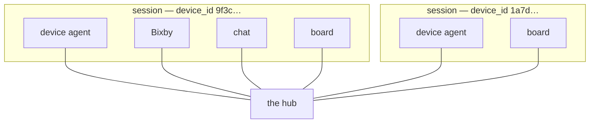

# GoalFlow CONTRACT — the generic goal-agent WebSocket protocol

**This file is the CANONICAL copy of the shared protocol. It is the anchor — obey it exactly.**

Five mirrors follow it, and **all of them move in ONE pass**:

| Mirror | File |
|---|---|
| Python | `src/goalflow_cloud/models/contract.py` |
| TypeScript ×3 | `src/types/contract.ts` in the chat, board and Bixby repositories |
| C# | `goal-flow-device-agent-ubuntu/src/GoalFlow.Device/Contracts/*.cs` |

> **There is no cross-repository atomic commit, so a half-mirrored change breaks at RUNTIME
> rather than at build time — and it does it silently.** Each repository stays internally
> consistent while the *system* is broken. Neither a compiler, a type checker nor any per-repo
> test can see it.

**And there is a sixth place, which is the worst of them.** Each surface's `src/lib/ws.ts` holds
an `INBOUND_TYPES` allowlist. **A frame type missing from it is silently dropped** — no error, no
log, nothing.

Both failures have really happened:

- A frame type reached this file and the C# mirror but not the Python one, whose `event` field is
  a `Literal`. Every one of the device's 35 `task_update` frames failed validation and was
  dropped. **The board sat at 0% with no error anywhere.**
- A command reached the device, this file and the device's constants, but not the Python
  `Literal`. The frame then failed validation on the **sender's** side, so the cloud logged a
  validation error to itself and the headline moment of a demonstration simply did not happen.

`scripts/verify_mirrors.py` (gate 14) is the check. Run it after **any** touch here.

---

## Compatibility rules

These are the properties that made five surfaces and two device ports survivable. Preserve them.

1. **Every change is ADDITIVE.** A new field is optional; a new frame type is one an older peer
   never receives or safely ignores. Nothing is renamed and nothing changes meaning in place.
2. **An unknown FIELD is ignored, never fatal.** Every model allows extra keys, so a newer peer
   can send a field an older one has never heard of.
3. **An unknown ENUM VALUE is ignored, never fatal** — for `agent_event.event`, `harness.module`,
   `harness.status` and `thinking.kind`. Adding one is additive by construction.
4. **An absent optional field means UNKNOWN, not zero and not false.** A consumer must not
   substitute a default that asserts something.
5. **A removal is a breaking change**, and there has not been one. If you need it, it is a
   contract version bump and every mirror moves together.

> **This file is the truth.** Where a mirror, a comment or a guide disagrees with it, this file
> wins and the other is a bug.

---

## Transport

- **WebSocket, JSON text frames.** The cloud is the hub and the server. Every surface and the
  device each open **one outbound** socket to it and register with `hello`.
- The field **`type`** discriminates every message.
- A goal-scoped message carries **`goal_id`**. A device-to-cloud message carries
  **`correlation_id`**.
- Route on `type` **plus session**. Deduplicate on `correlation_id`. On a drop, reconnect.

---

## Sessions — `device_id` is the pairing key

The hub is **multi-session**. A **session** is one **home**: exactly **one** device agent and
**N** surfaces, keyed by `device_id`.



- **Every frame routes only within its session**, chosen from the **sending socket's**
  `device_id` — never by role alone, and never broadcast across sessions.
- **A device owns its `device_id`**: a stable, self-generated, persistent UUID, overridable. A
  device reconnect closes (1012) only the previous socket of the **same** id; other homes are
  untouched.
- **Surface sockets are never evicted.**
- **A surface must be BOUND before it can send.** It binds by (a) sending `device_id` in `hello`,
  (b) the cloud auto-binding it when exactly **one** device is connected, or (c) answering the
  `devices` list with `select_device`. **Frames from an unbound surface are dropped.**
- An absent `device_id` on a **device** `hello` means `"default"` — zero-configuration single
  pairing.
- `goal_id` scopes the graph run (one checkpointer thread per goal). `device_id` scopes
  **delivery**. They are independent.

---

## Generic and domain-agnostic

**There are NO meal-specific fields in this protocol.** A `domain` string carries the use case —
`"meal_plan"`, `"guest_dinner"`, and so on — and domain specifics live in the device's capability
modules plus the free-form `scope` and `context` objects.

The same protocol must serve any goal. A domain slug the interpreter coins is valid here; it
simply has no observer watching it on the device.

---

## Frame index

| Frame | Direction | Purpose |
|---|---|---|
| `hello` | client → cloud | Register a role, a session and a surface |
| `hello_ack` | cloud → client | The session this socket is bound to |
| `devices` | cloud → ui | The online device list, for the picker |
| `select_device` | ui → cloud | Bind this socket to a device |
| `capabilities` | device → cloud → ui | The module registry the device advertises |
| `user_goal` | ui → cloud | The raw natural-language goal |
| `goal_accepted` | cloud → ui | The real `goal_id`, matched to the sender's `client_ref` |
| `chat_ui_open` | cloud → ui | Open the create-phase bracket |
| `understanding` | cloud → ui | **Gate 1** — what it understood, and what it will enforce |
| `speech` | cloud → ui | Say something out loud |
| `understanding_response` | ui → cloud | The answer to gate 1 |
| `notice` | cloud → ui | A terminal message with no plan |
| `chat_ui_close` | cloud → ui | Close the bracket |
| `dispatch` | cloud → device | The generic Task Contract |
| `agent_event` | device → cloud → ui | The live stream |
| `plan_ready` | device → cloud | The plan, the proposals, the verdicts |
| `present_plan` | cloud → ui | `plan_ready` plus `payload.knew` |
| `approval` | ui → cloud → device | **Gate 2** — the complete set of decisions |
| `control` | ui → cloud → device | The world clock, and the cross-goal push |
| `proposal` | device → cloud → ui | An adaptation |
| `status` | device → cloud → ui | What executed, and what the day looks like |
| `day_advanced` | device → cloud → ui | One world tick, summarised |
| `board_snapshot` | cloud → ui | Every goal |
| `board_update` | cloud → ui | One whole goal summary |
| `board_get` | ui → cloud | Heal a `board_seq` gap |
| `goal_state_get` | ui → cloud | Refill a goal's detail page |

One goal, end to end:

```mermaid
sequenceDiagram
    autonumber
    participant X as Bixby (input)
    participant H as Chat (create)
    participant B as Board (home)
    participant C as Cloud (hub + graph)
    participant D as Device (harness + planner)

    D->>C: hello · capabilities
    B->>C: hello · board_get
    C-->>B: board_snapshot

    X->>C: user_goal
    C-->>X: goal_accepted
    C-->>H: chat_ui_open (BEFORE interpretation)
    C-->>H: understanding + speech
    Note over H: GATE 1 — the user confirms what it understood
    H->>C: understanding_response
    C->>D: dispatch

    D-->>C: agent_event ×N
    C-->>H: agent_event
    C-->>B: board_update
    D->>C: plan_ready
    C-->>H: present_plan
    Note over H: GATE 2 — nothing firm runs before this
    H->>C: approval
    C-->>X: chat_ui_close
    C->>D: approval
    D->>C: status

    Note over B,D: later — the world moves
    B->>C: control advance_day (goal-less; it fans out)
    D->>C: proposal · status · day_advanced
    C-->>B: board_update
```

---

## Handshake and discovery

### `hello` (client → cloud)

```json
{ "type": "hello", "role": "ui", "device_id": "hub-a", "surface": "input" }
```

```json
{ "type": "hello", "role": "device", "device_id": "9f3c...", "device_name": "Kitchen Hub" }
```

| Field | Who | Meaning |
|---|---|---|
| `role` | both | `"ui"` or `"device"` |
| `device_id` | both, optional | The pairing key. **device:** its own stable id; empty means `"default"`. **ui:** the device it wants to watch; empty means unbound, awaiting an auto-bind or a picker |
| `device_name` | device, optional | A human label for the picker. It defaults to something **unique per agent** — it ends with a short slice of the `device_id`, so a picker never shows two identical entries |
| `surface` | ui, optional | `"input"`, `"chat"` or `"board"` — what this socket is **for** |

**`surface` is declared once at handshake and is immutable for the socket's lifetime.** Absent or
empty means the socket receives the full session broadcast, which is what makes the field
additive. Only `"input"` changes delivery — see *Surface-aware delivery*. `"chat"` additionally
opts into the create-phase replay. It is ignored on a `role: "device"` hello.

The cloud stores it **per socket**, alongside `(role, device_id)`. A session's surface list stays
flat: **surface is a property of the socket, not of the session.**

### `hello_ack` (cloud → client)

```json
{ "type": "hello_ack", "role": "ui|device", "session_id": "...", "device_id": "hub-a" }
```

`device_id` is the session this socket is bound to, or `""` for a still-unbound surface. It is
sent again in reply to a successful `select_device`.

### `devices` (cloud → ui)

Sent to an **unbound** surface — one with no `device_id`, where the cloud could not auto-bind
because there is not exactly one device — and again whenever the connected set changes.

```json
{
  "type": "devices",
  "devices": [
    { "device_id": "9f3c...", "device_name": "Kitchen Hub", "online": true },
    { "device_id": "1a7d...", "device_name": "Garage Hub", "online": true }
  ]
}
```

> **The list is ONLINE-ONLY.** A device with no live agent is **omitted**, not sent with
> `online: false`.

A surface may bind to a `device_id` that has **no** device connected: the cloud binds it to an
empty session and acknowledges it, and goals then decline for want of capabilities.

**So a surface must treat "my bound `device_id` is absent from this list" as "my device is
offline"**, and self-heal: rebind automatically when exactly one device is online, else show the
picker.

### `select_device` (ui → cloud)

Binds this socket to a device — the picker's answer. The cloud replies with `hello_ack` carrying
the bound id.

```json
{ "type": "select_device", "device_id": "9f3c..." }
```

### `capabilities` (device → cloud → ui)

The device advertises its **module registry** — the extensibility and discovery surface. A module
is either a `capability` (a tool the planner may call) or `steering` (a harness module that
guards or shapes the run).

```json
{ "type": "capabilities", "modules": [
    { "name": "Inventory", "kind": "capability",
      "functions": [
        { "name": "GetExpiringItems", "description": "...", "side_effecting": false },
        { "name": "Add", "description": "...", "side_effecting": true, "tier": "light" }
      ] },
    { "name": "Safety", "kind": "steering",
      "description": "deterministic hard-constraint filter" }
] }
```

It also carries **`domains`** — `[{ "id": "meal_plan", "hint": "…what this domain MEANS…" }]` —
derived from the device's registered observers.

> **This is what makes the actionability gate generic.** The cloud asks the model whether a goal
> can plausibly be advanced *using these functions*, rather than checking a hardcoded list of
> topics. **What this assistant can do is a fact about the device that is plugged in.**
>
> The `hint` is load-bearing: without it the interpreter invents plausible slugs that no observer
> answers to, and a guest dinner labelled as a meal plan silently loses its RSVP watching.

---

## The create phase

### `user_goal` (ui → cloud)

```json
{ "type": "user_goal", "text": "...", "client_ref": "g-17" }
```

`client_ref` is minted by the sender and echoed straight back in `goal_accepted`.

> **With two goals in flight a surface cannot otherwise tell which inbound `goal_id` is which
> submission.** It would have to adopt whichever arrived first, and mis-key the card. Optional: a
> client that omits it still works.

### `goal_accepted` (cloud → ui)

```json
{ "type": "goal_accepted", "goal_id": "uuid", "client_ref": "g-17" }
```

### `chat_ui_open` / `chat_ui_close` (cloud → ui) — the bracket

The chat surface is **ephemeral** on a real device: Bixby opens a webview hosting it when a
goal's create phase begins, and closes it when that phase ends. These two frames are that
bracket. **The device never sees either.**

```json
{ "type": "chat_ui_open",  "goal_id": "...", "goal_text": "Plan my weekly meal." }
```

```json
{ "type": "chat_ui_close", "goal_id": "..." }
```

**`chat_ui_open` is emitted the INSTANT `user_goal` arrives — before interpretation runs.**
Interpretation is a multi-second round trip, and emitting the open afterwards meant the whole of
the slowest wait in the product happened with **no webview on screen at all**: the user spoke to
the fridge, the fridge showed nothing, and the understanding card then appeared as though the
work had been instant.

Nothing about the open depends on interpretation — it is a **reset keyed to a `goal_id`**, which
is minted on arrival.

It carries **`goal_text`**, verbatim, for the same reason: during interpretation that frame is
the only thing the chat surface knows, and a panel that cannot say what it is working on has
nothing to show but a spinner. Optional, so an older client is unaffected.

It has a **dual role**, one per surface:

| Surface | Meaning |
|---|---|
| `input` (Bixby) | Open the webview, or ensure it is open, pointed at the chat surface |
| `chat` (the webview) | A **HARD RESET** keyed to `goal_id`: drop all state from any prior goal, and from now on ignore goal-scoped frames whose `goal_id` differs |

> **The reset is IDEMPOTENT per goal.** An open for the goal the surface is already keyed to is a
> no-op — the bind-time replay re-sends it, and resetting then would throw away the very state
> the replay is about to restore.

**`chat_ui_close` is emitted when the create phase TERMINATES**, on any of:

1. the **initial** `approval` frame for the create-phase goal — the normal path;
2. `understanding_response { confirmed: false }` — cancelled at the gate;
3. a terminal error after the open, so the webview can never dangle.

Bixby closes the webview **only if `goal_id` matches** the goal it currently has open. The chat
surface returns to idle.

> **Pairing invariant.** `chat_ui_close(g)` is emitted only if `chat_ui_open(g)` was, and only
> while `g` is still the session's current create-phase goal — with **one** exception: an open for
> a **new** goal *supersedes* the previous create phase **without** an intervening close. Bixby's
> rule (close only on a matching id; open means ensure-open-and-retarget) makes that a retarget
> rather than a close-and-reopen flicker.
>
> An adaptation approval from the board never triggers a close: by then the goal is no longer the
> create-phase goal, so trigger 1 cannot match.

**Why close on the approval and not on execution-started:** the webview should vanish at the
user's final tap, and there is no single "execution started" frame to hook — after approval the
device may stream an executing phase, or defer everything, or be **offline**. Closing on the
approval is correct in every one of those futures, while waiting on the device leaves a dead
webview open exactly when things go wrong.

### `understanding` (cloud → ui)

Emitted after the cloud interprets the goal and resolves memory, **before any device dispatch**.
The graph is paused until the surface answers.

```json
{ "type": "understanding", "goal_id": "...", "task_status": "grounding",
  "payload": {
    "objective": "...",
    "domain": "meal_plan",
    "knew": { "allergens": ["peanuts"], "dietary": ["no_pork"] },
    "constraints": [
      { "id": "c-allergen-peanuts", "kind": "allergens", "label": "peanut allergy",
        "value": "peanuts", "enforcement": "hard", "source": "account",
        "why": "always enforced" }
    ],
    "preferences": [
      { "id": "s-prefer-white-meat", "label": "prefers white meat",
        "value": "prefer white meat, chicken turkey fish over red meat",
        "source": "account", "why": "tagged" }
    ],
    "thought": "I'll shape a meal plan around your constraints before planning.",
    "time_window": { "start": "<ISO>", "end": "<ISO>" }
  } }
```

| Block | What it is |
|---|---|
| `knew` | The chips — what it will hold |
| `constraints` | One provenance row per applied **hard** constraint. `source` is `account`, `derived` or `chat`; `why` says whether it is always enforced, picked for this domain, or captured |
| `preferences` | The **soft** half: one row per entry, with **no** `enforcement` field, because there is nothing to enforce |

> **A preference shapes a plan and can never block one.** That is why it is a separate block
> rather than more chips: a surface that renders the two alike teaches the reader that a chip is
> just a chip.

`constraints` and `preferences` are **additive**, so a surface that ignores them keeps working —
`knew` is unchanged.

**Display is not enforcement.** A store entry may carry `display_to`, the domains its chip is
worth **showing** on. It has no bearing on resolution: the hard list kinds still union with
`applies_to` ignored, and `dispatch.constraints.hard` still carries the **full** enforced set. It
only narrows `knew` and `constraints`.

> **Hiding a chip never hides a rule.** A home-preparation goal shows no food chips while still
> being dispatched — and still being blocked by — every allergen the household holds.
> `present_plan.knew` applies the same filter, so the gate and the plan card cannot disagree.

**Capture.** When the message **states** a household rule, the payload also carries
`proposed_constraints` — `[{id, kind, value, enforcement, label, quote, expires_on}]` — and the
response answers with `accepted_constraint_ids`.

> **Only the ids sent back are ever written.** The model proposes; the user disposes; and a
> confirmed **goal** never implies a confirmed **rule**.

When the message is *only* a statement, `capture_only: true` says there is no plan coming and the
gate is asking about the rules alone. Confirming it ends with a `notice` of kind `captured`, and
**no board card is ever created**.

### `understanding_response` (ui → cloud)

```json
{ "type": "understanding_response", "goal_id": "...",
  "payload": { "confirmed": true, "accepted_constraint_ids": ["proposed-1"] } }
```

`confirmed: true` resumes the graph to dispatch. `false` ends it gracefully, with no device
dispatch.

### `speech` (cloud → ui)

The cloud asking a surface to **say something out loud**. It is sent immediately **after** the
frame it speaks for, so a surface always has the card on screen before the voice describes it.

```json
{ "type": "speech", "goal_id": "...",
  "payload": {
    "utterance_id": "u-<goal_id>-understanding",
    "cue": "understanding",
    "text": "Here's what I understood. Plan a week of healthy family dinners that cut food waste. That covers August 4 through August 9. I'll hold 2 household rules: peanut allergy and low sodium. Shall I go ahead and plan it?",
    "url": "/speech/u-<goal_id>-understanding.mp3"
  } }
```

| Field | Rule |
|---|---|
| `url` | A **PATH, not an absolute URL.** The cloud does not know which host and port a surface reached it on — a tablet, the Hub browser and a laptop all differ — so the surface resolves it against the origin of the socket it is already on |
| `text` | The spoken words verbatim: the caption, the accessibility fallback, and the only thing left when synthesis fails |
| `utterance_id` | **Deterministic** per `(goal_id, cue)`. The replay cache re-sends this frame, and the same sentence must not be synthesized — or billed — twice |
| `cue` | Names the moment: `understanding`, `working_start`, `working_plan`, `plan`, `approvals`, `saved`. **The field exists so the next moment is a string, not another frame type** |

**`GET /speech/{utterance_id}.mp3`** is the hub's only HTTP route. **Synthesis happens on that
fetch**, not when the frame was sent, so the gate never waits on the provider and an utterance
nobody plays is never paid for.

An unknown id is **404** — only text the cloud itself minted is reachable, so the route is not a
synthesis oracle. No key is **503**. A provider failure closes the body early. **Every one of
those is a surface that stays quiet.**

> **Additive and ignorable.** A surface that has never heard of this frame drops it and renders
> exactly as it would in silence — the gate is complete, legible and answerable without a voice.
> **That is also the failure mode:** no key on the cloud means the frame is **never sent at all**,
> so "no voice" is a normal state, not an error.

> **Autoplay is the surface's problem, and it is a real one.** A browser rejects `audio.play()`
> with `NotAllowedError` unless the document has user activation, and a cross-origin webview
> additionally needs `allow="autoplay"` on its iframe. **A surface that handles this frame MUST
> degrade to a tap-to-play affordance rather than assume it can speak.**

One cue is **one frame per sentence**. A browser handed a chunked MP3 with no `Content-Length`
waits for the complete body, so a single long utterance meant seconds of silence before anything
was heard.

### `notice` (cloud → ui)

A terminal, non-plan message.

```json
{ "type": "notice", "goal_id": "...", "kind": "out_of_scope",
  "message": "That's outside what I do. I'm your home goal assistant — I can help with <the device's advertised capabilities>. Try one of those and I'll get going." }
```

| `kind` | Meaning |
|---|---|
| `out_of_scope` | The interpreter judged the goal outside what the device can advance |
| `declined` | Cancelled at the understanding gate. Sent **alongside** `chat_ui_close`, so the input surface can speak the cancellation while the webview closes |
| `captured` | A household rule was written. There is no plan coming |
| `updating_goals` | **Non-terminal.** A mid-save progress message |

The actionability verdict comes from the interpreter, judged against **whatever the connected
device advertises** rather than a fixed list of topics. A goal nothing advertised relates to ends
before any device dispatch, and the surface receives a `notice` instead of an `understanding`.

---

## Planning

### `dispatch` (cloud → device) — the generic Task Contract

```json
{ "type": "dispatch", "goal_id": "...", "domain": "meal_plan",
  "objective": "...",
  "success_criteria": ["..."],
  "constraints": {
    "hard": { "allergens": [], "medical": [], "dietary": [],
              "budget_cap": null, "quiet_hours": null,
              "peak_hours": null, "away_window": null,
              "budget_envelope": null },
    "soft": { }
  },
  "scope": { },
  "time_window": { "start": "<ISO>", "end": "<ISO>" },
  "autonomy": "tiered",
  "context": { "notes": "..." } }
```

| Field | Rule |
|---|---|
| `constraints.hard` | A **safety policy** object. It is the **ONLY** thing the device's safety filter enforces |
| `constraints.soft` | Preferences. They bias planning and **never** gate it |
| `scope` | Domain-flexible — whatever the domain needs. No fixed shape |
| `time_window` | **Relative** to the day the world is on. Never a hardcoded date |
| `autonomy` | `"tiered"` — side effects are proposed with a tier |

**The cloud resolves `constraints.hard` per goal, by code**, from the household constraint store.
The list kinds — allergens, dietary, medical — are unioned across the whole store **regardless of
domain**; the cap and window kinds are domain-picked. So a vacation goal carries a travel cap and
an away window where a meal goal carries the weekly grocery cap.

> **No model output ever reaches this block.**

`budget_envelope` — `{"cap": 600.0, "period": "monthly"}` — is the shared pool **every** goal
draws from. Per-goal caps alone cannot stop two goals spending the same money: a $200 party and a
$120 grocery week each fit their own ceiling and together blow a month.

**The device** resolves the effective ceiling as `min(budget_cap, cap − spent)` when it arms the
policy, and again on approval and on each day tick — **the cap is policy from the account; the
spend is world state the device owns.** The rules themselves still read `constraints.hard` and
nothing else; the arithmetic happens in a resolution step **before** arming.

### `agent_event` (device → cloud → ui) — the live stream

**Streamed as the device works.** The cloud relays these **unchanged**.

```json
{ "type": "agent_event", "goal_id": "...", "correlation_id": "...", "seq": 1,
  "event": "phase" | "thinking" | "tool_call" | "tool_result" | "plan_progress" | "task_update" | "harness",
  "payload": { } }
```

> **`seq` is monotonic PER GOAL, and a consumer MUST drop any frame whose `seq` is not greater
> than the last it saw for that `goal_id`.**
>
> Which is why the device's trace scope is per goal: a shared counter once sent one goal's frames
> out under another's id with a sequence that had gone **backwards**, and every one of them was
> silently discarded.

| `event` | `payload` |
|---|---|
| `phase` | `{ "phase": "queued" \| "grounding" \| "planning" \| "checking" \| "awaiting_approval" \| "executing" \| "monitoring" \| "adapting" }` |
| `thinking` | `{ "text": "...", "kind"?: "narration" \| "step" \| "notice", "step"?: "...", "detail"?: "..." }` |
| `tool_call` | `{ "module": "...", "function": "...", "args": { } }` |
| `tool_result` | `{ "module": "...", "function": "...", "summary": "..." }` |
| `plan_progress` | `{ "item": { }, "total": 7 }` |
| `task_update` | `{ "task_id": "t2", "title": "find recipes", "state": "monitoring", "depends_on": ["t1"], "progress_pct": 43, "pending_tasks": 4, "next_step": "build the shopping list", "retry_count": 0, "failure_reason": null }` |
| `harness` | `{ "module": "safety", "status": "block", "note": "blocks \"peanut sauce\"", "verdict": "1 blocked", "grade": "A1" }` |

#### `thinking.kind`

Optional; absent means `narration`.

| Kind | Meaning |
|---|---|
| `narration` | Streamed model prose, arriving a **fragment** at a time. The consumer merges it |
| `step` | One labelled step, **whole on arrival, never fragmented**. `step` is the headline and `detail` the sub-line |
| `notice` | The run talking about itself: a retry, a fallback, a safety block |

`text` always holds `"step — detail"`, so a consumer that ignores the newer fields still reads a
sentence.

> **A `step` exists because the compose call is not streamed** and keeps its plan JSON off this
> channel deliberately. Without it, the planner emitted **nothing** on a healthy run — and a
> silent engine is indistinguishable from a broken one.

#### `plan_progress.total`

Optional: how many items the finished plan has.

The device composes a plan in **one** non-streaming call and then emits every item in a single
loop, so all N frames land together and a surface cannot tell how many are still coming. With
`total`, a surface reserves exactly N rows before filling any of them, for a goal of any shape.

> **A consumer MUST treat an absent `total` as unknown, not as zero.**

#### `task_update`

The device emits one every time a task changes state. **The goal's task DAG lives on the
DEVICE** — only it can ground a decomposition — so this is how the cloud learns what a goal is
made of and how far along it is.

`progress_pct`, `pending_tasks` and `next_step` are the goal-level rollup as of that transition,
**derived from task state, never from the clock**.

`state` is one of — **snake_case, like every other enumeration on this wire**:

```
created | ready | planning | awaiting_approval | executing
monitoring | adapting | paused | retrying | completed | failed
```

> These were unlisted once, and the drift that followed is why they are written down. The device
> serialised its enum with `ToString().ToLowerInvariant()` and shipped `awaitingapproval` while
> `task_status` and `phase` carried `awaiting_approval` — one wire, two spellings of one idea. It
> hid because `awaiting_approval` is the only multi-word value, so every other one round-tripped
> by accident. **An example alone does not pin an enumeration; the list does.**

#### `harness`

It names the specific **harness engine** at work, where `phase` is coarse. It is what a surface
renders as the pipeline lighting up engine by engine.

- `module` ∈ `precheck | capability_manager | grounding | planner | safety | task_manager | approval | monitor_adapt`
- `status` ∈ `enter | active | pass | block | done | skip` — `active` lights the engine up,
  `pass` and `done` resolve it green, `block` resolves it red, `skip` greys it out.
- `note` is the engine's live one-line sub-text; `verdict` a short badge; `grade` the automation
  grade on a safety beat.

Additive, like `phase`: an unknown module or status is ignored, never fatal.

`phase: "queued"` means another goal holds the single planning slot and this one starts next. **It
exists so a waiting goal is visible rather than appearing stalled.**

### `plan_ready` (device → cloud)

```json
{ "type": "plan_ready", "goal_id": "...", "correlation_id": "...",
  "task_status": "awaiting_approval",
  "payload": {
    "plan": [
      { "id": "s1", "day": 1, "title": "...", "detail": "...", "when": "<ISO?>",
        "why": ["..."], "tags": ["..."] }
    ],
    "proposals": [
      { "proposal_id": "p1", "action": "...", "module": "ShoppingList",
        "function": "Add", "args": { }, "tier": "auto" | "light" | "firm",
        "reason": "...", "requires_approval": true }
    ],
    "safety": { "gate": "passed" | "blocked", "violations": [] },
    "precheck": { "ok": true, "results": [] },
    "impact": [ { "label": "...", "value": "..." } ],
    "demo_events": [
      { "id": "day3-football", "day": 3, "label": "Thu",
        "title": "Football practice", "kind": "calendar.event_overlap", "order": 3 }
    ],
    "considered": 17,
    "rejected": [ { "option": "pork belly stir-fry", "reason": "no pork" } ],
    "narration": "Chicken three nights, fish on Thursday, and everything that would have spoiled gets used up before you go away.",
    "explanation": "..."
  } }
```

**`plan[].day` is the 1-based plan-day index** — the source of truth for ordering. A surface
renders it, and an event targets a plan item by it.

**`plan[].status`** may be `"skipped"`, with a `status_reason`. A skipped row **keeps its place**
and shows its reason: a plan that merely got shorter says nothing about why, and reads as data
loss rather than as a decision.

**`safety.gate` and `precheck.ok` route differently, and must not be conflated.** A safety block
is *"never, as asked"*. A precheck block is *"not yet"* — the world is not ready, and the goal
**waits** rather than completing.

**`narration`** is optional: the plan **written to be spoken aloud**, two short sentences.

> **It is NOT a shorter `explanation`.** That one is read on a screen and may be a paragraph;
> this one is heard once, by someone who may not be looking. **Both are written by the SAME
> compose call**, which is the point — a narration produced by a second model reading the plan
> afterwards could contradict it, and would cost a round trip at the one moment the user is
> waiting for good news.
>
> Absent or empty means the voice says nothing about the plan. There is deliberately **no
> deterministic fallback**: code can only count rows, and *"seven items, three needing approval"*
> describes a data structure rather than a week of dinners. The cloud drops it silently if it
> exceeds 260 characters — a sentence cut mid-clause is worse than no sentence.

**`considered` and `rejected`** are optional, **model-authored and display-only**. Nothing
downstream reads them.

> A wrong rejection reason costs a wrong sentence, which is the right price for the clearest
> evidence a person can be given that something **reasoned** rather than looked up — a lookup
> table cannot reject. Absent is normal, and a model that weighed nothing is told to omit them
> rather than invent a number.

**`demo_events`** is an optional display catalogue of presenter-fired events. A surface renders
one chip per entry, and firing a chip sends `control` with `trigger_event`.

### `present_plan` (cloud → ui)

`plan_ready` relayed, **plus `payload.knew`** — the "what it knew" personalisation the cloud
injected. `payload.demo_events` is relayed through unchanged when present.

### `approval` (ui → cloud → device)

```json
{ "type": "approval", "goal_id": "...", "correlation_id": "...",
  "payload": { "decisions": [ { "proposal_id": "p1", "approved": true } ] } }
```

> **`decisions` is the COMPLETE set for the initial plan** — every approval-required proposal
> (`tier != "auto" && requires_approval`), approved **or** declined, in **ONE** frame.
>
> The device resumes the whole plan on the **first** `approval` frame it receives: it lifts its
> interrupt and executes the approved effects, skipping the declined and unlisted ones. A surface
> that sent one frame per click would therefore drop every later proposal — and, because the
> cloud closes the create-phase webview on the first approval, close the webview early too.
>
> **So a surface MUST accumulate its per-proposal clicks and emit a single frame once every
> approval-required proposal is decided.**

---

## The living goal

### `control` (ui → cloud → device)

```json
{ "type": "control", "goal_id": "...?",
  "command": "advance_day" | "reset" | "set_date" | "trigger_event" | "constraints_changed",
  "payload": { "date": "<ISO?>", "event_id": "day3-football" } }
```

> **`goal_id` is OPTIONAL.** The simulated clock is **global**, one per device, so a clock command
> with **no `goal_id`** is a **world-level tick**: the device advances the clock **once** and fans
> out to **every** active goal — emitting a `status` per goal, a `proposal` where a goal newly
> catches a material change, and one `day_advanced` summary. A `goal_id` scopes the older
> per-goal path.

`trigger_event` fires one presenter event by id, for a specific goal.

**`constraints_changed` (cloud → device, goal-scoped) is the one adaptation path that does NOT
ask.** The account re-resolved *this* goal's constraints because **another** goal was approved —
the family said they are away, so a meal week has days it should not be planning dinners for.

The payload carries `hard` (the account's new `constraints.hard`, **verbatim** — the device
re-arms from it and authors nothing), `steer` (how to re-plan) and `note` (one sentence for the
board).

> **The device applies the patch immediately and never opens an approval**, because the user
> already approved this when they approved the other goal, **and asking twice about one decision
> implies the first answer did not count.** It reports the change with
> `status.plan_changed_note`.

### `proposal` (device → cloud → ui) — an adaptation

```json
{ "type": "proposal", "goal_id": "...", "correlation_id": "...",
  "task_status": "adapting",
  "payload": { "proposal_id": "a1", "action": "...", "detail": "...",
               "trigger": "...", "tier": "..." | "adapt", "requires_approval": true,
               "event_id": "day3-football",
               "patch": { "upsert": [ { "id": "s3", "day": 3, "title": "...", "detail": "..." } ],
                          "remove": [], "impact_delta": [], "rationale": "..." } } }
```

`patch` is the scoped plan diff an adaptation applies: `upsert` rows to add or replace, each with
its `day`; `remove` ids; plus `impact_delta` and a short `rationale`.

> **The `adapt` tier is an ORIGIN, not a consent level.** It says the sustain loop proposed this.
> An adaptation carries the grade of the effect it actually performs.

### `status` (device → cloud → ui)

```json
{ "type": "status", "goal_id": "...", "correlation_id": "...",
  "task_status": "...",
  "payload": { "day": "?", "sim_date": "?", "material": false,
               "executed": [], "note": "...",
               "event_id": "day3-football",
               "updated_plan": [ { "id": "s3", "day": 3, "title": "...", "...": "..." } ],
               "changed_ids": ["s3"],
               "impact_delta": [ { "label": "...", "value": "..." } ] } }
```

On an applied adaptation the status carries the **new full plan** in `updated_plan`, so a surface
replaces its plan in place; `changed_ids` to highlight; `impact_delta` to merge; and the
`event_id` that drove it. A quiet tick omits all of those.

**`executed[]` carries four outcomes, not three:**

| `result` | Meaning | Re-applying helps? |
|---|---|---|
| `executed` | It ran | — |
| `deferred_precheck` | **Not yet.** The world moved between planning and approval. The approval **still stands** | **Yes** |
| `blocked_safety` | **Never, as asked.** The gate refused it | No |
| `failed_actuator` | It ran and threw | Perhaps |

> A refused effect must come back as a **block**, not as a silent success with the refusal buried
> in a detail string.

**`sim_date` is how the cloud learns which day the world is on.** The device runs a simulated
clock; the hub reads that day off this frame — and off `day_advanced` — and keeps it per session,
so every node reasons in the **device's** day rather than the hub machine's.

### `day_advanced` (device → cloud → ui)

```json
{ "type": "day_advanced", "sim_date": "2026-07-16", "day": 3,
  "events": [ { "id": "daily:ev-football", "title": "Day 3 - football practice added Wed",
                "kind": "calendar.event_overlap", "summary": "...",
                "goal_ids": ["<goal_id>"] } ] }
```

Emitted once per **world-level** tick. It summarises the world events that happened on the new
day and which goals each was material to. An event with empty `goal_ids` happened but touched no
active goal; a quiet day sends an empty list.

The per-goal `status` and `proposal` frames riding alongside it already updated each card.

---

## The board

The board watches **every** goal at once, where every other frame is about one. **The cloud
derives these** — it already routes every frame a goal produces, so it can fold them without
asking anyone. **The device is not involved.**

```json
{ "type": "board_snapshot", "board_seq": 42, "goals": [ ] }
```

```json
{ "type": "board_update", "board_seq": 43, "goal": { } }
```

```json
{ "type": "board_get" }
```

A `GoalSummary`:

```json
{ "goal_id": "uuid", "client_ref": "g-17",
  "title": "Birthday Party Preparation",
  "subtitle": "Sun, Jun 22 • 20 Guests",
  "domain": "guest_dinner",
  "state": "on_track" | "at_risk" | "waiting" | "completed",
  "task_status": "monitoring",
  "progress_pct": 68,
  "next_step": "Buy party decorations",
  "eta": "2026-06-22",
  "pending_tasks": 3,
  "alerts": { "count": 2, "severity": "danger" | "warn" | null },
  "activity": ["Grocery delivery confirmed", "Decor ideas ready"],
  "plan_changed_note": "...",
  "updated_at": "<ISO>" }
```

**Semantics:**

- A full **snapshot** on bind and in reply to `board_get`. **An update carries a WHOLE
  `GoalSummary`, replaced by `goal_id`** — a delta exists to avoid re-sending N goals, not to
  save bytes within one. Whole-object replacement is **idempotent**, so a duplicate or
  out-of-order update cannot corrupt a card.
- **`board_seq` is monotonic per session.** A surface that sees a gap sends `board_get` and heals.
  Without it, a dropped update leaves a card permanently stale **with no way to notice**.
- **`state` has four values, and `waiting` covers *anything* waiting on a human or on the world**
  — an open gate, an approval, a queued plan, a failed pre-check. Deliberately: from a board,
  *"someone needs to do something"* is one idea.
- **`alerts.count` is what is OUTSTANDING right now, not a running tally.** An adaptation raises
  an alert; approving it — **or declining it** — clears it. Leaving the adapting state is the
  test, not having executed something.
- **`activity` is what has actually OCCURRED.** A pending proposal is **not** activity: it is
  waiting on a person and belongs in `next_step`. Recording it in both made a card print the same
  sentence as done **and** next.

> **A snapshot is the only thing that can RETRACT a card.** An update can replace one, never
> remove it — which is why a retired goal reaches a surface as a fresh snapshot.

### `goal_state_get` (ui → cloud)

```json
{ "type": "goal_state_get", "goal_id": "..." }
```

Re-sends the cached `present_plan` for a goal, then its latest `status`. This is what makes
drilling into a day-old goal show a plan rather than an empty stage after a reload.

> **The `agent_event` stream is deliberately NOT replayed.** A rejoined view shows the plan and
> its ticks, not a re-run of the thinking.

### The board WRITES

> **The board is a first-class surface, not a read-mostly projection.** Once a goal's initial plan
> is approved on the chat surface, the board becomes that goal's primary surface: it renders the
> raw device stream on a per-goal detail page, and it **SENDS `control`** (the world clock) and
> **`approval`** (an adaptation decision).

**The chat surface and the board are split TEMPORALLY, not by capability.** Chat owns goal
*creation* — the understanding gate, the first plan, the first approval. The board owns
everything after. Both are ordinary `role: "ui"` sockets, distinguished only by which frames each
renders and sends.

That division is checked. Gate 14 holds a per-surface exemption set for each mirror, so a
surface that stops carrying a frame its role now needs — or grows a frame that belongs to the
other one — **fails the gate and forces the decision to be made on purpose rather than by
drift**.

---

## Surface-aware delivery

One fork, in **one** place. Every cloud-to-surface frame for a session goes through a single
fan-out point, and a per-surface **interest predicate** is consulted there, in the send loop, per
target socket. No per-call-site routing table, and no new send paths. The same predicate gates
the bind-time pushes.

| `surface` | Receives via the session fan-out |
|---|---|
| *(absent or empty)* | **Everything** |
| `"chat"` | **Everything** — its own `INBOUND_TYPES` allowlist does the filtering |
| `"board"` | **Everything** — same |
| `"input"` | **ONLY** `hello_ack`, `goal_accepted`, `chat_ui_open`, `chat_ui_close`, `notice` |

Anything outside the `input` row is simply **not delivered** to an input socket — no live stream
and no board firehose for a native client that would only drop it.

Handshake and discovery frames sent point-to-point to a specific socket (`hello_ack`, `devices`)
are **outside** the fork and always delivered: an input surface still needs the device picker.

> **The fork is deliberately NOT extended to `chat` and `board`.** Their allowlists already work,
> the webview lifecycle already scopes the chat surface in time, and a server-side per-type table
> would reintroduce the "forked to nobody, so silently dropped" failure this file warns about at
> the top.

### The create-phase replay cache

The cloud keeps, per session, the **current** create-phase goal's state:
`{ goal_id, goal_text, understanding?, present_plan?, notice? }` — the exact frames it broadcast,
captured as they were sent.

| Event | Effect |
|---|---|
| `chat_ui_open` is emitted | **Created.** The goal becomes the session's create-phase goal |
| `understanding` is emitted | Captured |
| `plan_ready` is handled | `present_plan` captured |
| A **terminal** notice is emitted | Captured — `out_of_scope` or `declined`, **never** the mid-save `updating_goals` |
| The gate is **answered** | The `understanding` is **resolved out** of the cache |
| `chat_ui_close` is emitted | **Cleared** |
| A superseding open for a new goal | **Replaced** wholesale |

On the bind of a socket whose surface is `"chat"` — and only `"chat"` — the cloud replays, after
the existing bind-time pushes:

1. `chat_ui_open { goal_id }`;
2. then the cached **notice** if there is one, **alone**, because it is terminal;
3. else the cached `understanding` if the plan has not arrived;
4. else the cached `present_plan`.

This mirrors how the board rehydrates on bind, and it closes the race between the webview
connecting and the understanding being computed. Connect early and the frames arrive by
broadcast — the open-before-understanding ordering guarantees the reset lands first. Connect late
and the replay delivers the same sequence.

> **The notice half exists for that race in its sharpest form.** A refusal has **no round trip in
> it at all**: the cloud opens the bracket and broadcasts the notice in the same breath, while
> Bixby is still mounting the iframe off that open — so the frame reached a socket that had not
> connected. Uncached, the user watched a blank webview appear and close seconds later.

> **The confirmed understanding is resolved out of the cache** because a socket reconnecting
> during planning would otherwise be handed back the gate it had already answered, and the
> surface would jump backwards mid-run.

---

## The task-status lifecycle

```
created -> interpreting -> grounding -> planning -> checking ->
awaiting_approval -> executing -> monitoring -> adapting -> done
```

---

## Invariants

1. **Tiered proposals.** A side-effecting call is **proposed** with a tier (`auto` / `light` /
   `firm`); **nothing firm executes until approval**.
2. **Hub-only.** A surface and the device **never** talk directly. All traffic goes through the
   cloud.
3. **"LLM plans, code checks."** The safety filter is deterministic code, **separate** from the
   planner. It enforces `constraints.hard` and nothing else.
4. **A generic clock.** The device reads a clock — real today, or one driven by a `control`
   frame — and **never** a hardcoded date.

---

## Changing this file

1. **Change this file first.** It is the anchor.
2. Then, in **one pass**: `models/contract.py` · the three `types/contract.ts` files ·
   `Contracts/*.cs` · **and the three `INBOUND_TYPES` allowlists**.
3. Run `python scripts/verify_mirrors.py`.
4. Keep it **additive**. A new field is optional; an unknown value is ignored.

> **Gate 14 parses this file**, so its FORMATTING is load-bearing. It reads:
>
> - every frame type out of the `"type": "…"` JSON examples;
> - the `agent_event` kinds and the `control.command` values out of their **alternation lines**;
> - the `task_update.state` list out of the fenced block after *"`state` is one of"*.
>
> **Deleting an example, or rewriting one of those lines as prose, removes something from the
> checked set.** The gate now refuses to let that happen quietly: it prints all four counts and
> **fails if any falls below the floor pinned in `CONTRACT_FLOORS`**.
>
> Growth is unaffected — an additive change raises a count and needs no edit there. A **removal**
> is a breaking change by the rules above, so lowering a floor is a deliberate edit in the same
> commit. **Never lower one to make a red gate green.**
