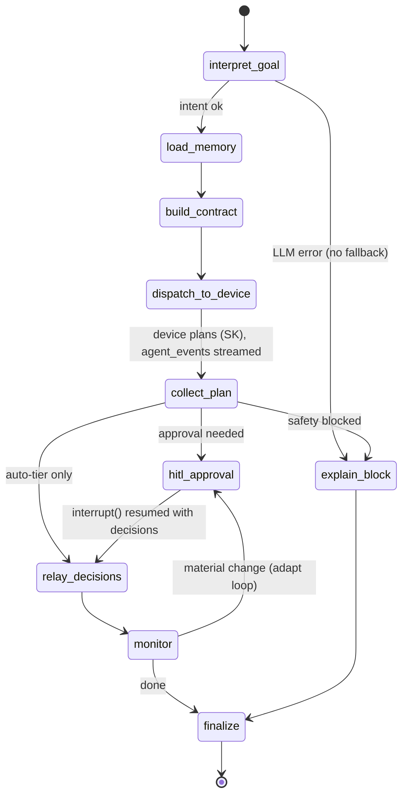

# Cloud Agent Architecture (v2)

## Role

GoalFlow v2 is a **general goal-based agent** (not a meal app). The cloud is one of
three tiers:

| Tier   | Owns                                                    | Never does                    |
|--------|---------------------------------------------------------|-------------------------------|
| UI     | Conversation surface, approval clicks, the live stream  | Talks to the device directly  |
| Cloud  | **Conversation + memory**, goal interpretation, the generic Task Contract, HITL, routing | Touches actuators / local state |
| Device | **Local truth**, SK function-calling planner, capability modules, Safety filter, actuators | Talks to the UI directly |

The cloud:

1. Owns the **conversation** with the human and the **family memory** (hard/soft split).
2. **Interprets** the fuzzy goal into a generic **Task Contract** (`dispatch`,
   see [`../CONTRACT.md`](../CONTRACT.md)) — LLM structured output, any domain.
3. **Dispatches** to the device, which does the actual SK function-calling planning
   over its advertised capability modules.
4. **Relays** the streamed `agent_event`s, the plan, `proposal`/`status` to the UI,
   and `approval`/`control` back to the device.
5. Holds the **HITL approval pause** as a durable LangGraph `interrupt()`.

Two gates, deliberately distinct — **"LLM plans, code checks"**:

- **Safety gate** — deterministic **code on the device**; enforces only
  `constraints.hard`; *blocks*.
- **Approval gate** — the **user via the cloud** (LangGraph `interrupt()`); *waits*.

**LLM-only**: goal interpretation is a real LLM call (OpenRouter, OpenAI-compatible
API). There are **no scripted/rule fallbacks** — if the LLM is unavailable the goal
fails loudly with a structured error, it is never faked.

## The LangGraph StateGraph

`src/goalflow_cloud/graph/nodes.py`. Advanced LangGraph: `StateGraph` +
conditional edges + `interrupt()` HITL + a checkpointer for durable state across
the approval pause. One graph run per goal; `thread_id = goal_id` so the
checkpointer can resume the exact paused state when the approval (or an adaptation
decision) arrives, even across process restarts (swap `MemorySaver` for a
persistent checkpointer without touching the graph).

### State schema

```python
class GraphState(TypedDict, total=False):
    goal_text: str                     # raw user_goal text
    intent: dict                       # normalized intent (LLM structured output):
                                       #   domain, objective, success_criteria,
                                       #   scope, time_window (relative to today)
    memory: dict                       # loaded profile: hard block + soft prefs + context
    contract: dict                     # the assembled generic Dispatch frame
    plan: dict                         # plan_ready payload from the device
    pending_approvals: list[dict]      # proposals awaiting user decisions
    decisions: list[dict]              # approval decisions returned by interrupt()
    task_status: str                   # CONTRACT v2 lifecycle value
    event_log: list[dict]              # append-only agent_event/trace log (Annotated add)
    goal_id: str
    correlation_id: str
    error: str                         # structured failure (LLM-only: no fallback path)
```

### Nodes

| Node               | Harness module          | Does |
|--------------------|-------------------------|------|
| `interpret_goal`   | Goal Interpreter        | LLM **structured output**: fuzzy text → `{domain, objective, success_criteria, scope, time_window}`. Time window derived **relative to real today**. |
| `load_memory`      | Memory & Constraints    | Load the generic profile; split channels: `hard` → verbatim into `constraints.hard`; `soft` + context → planning bias only. |
| `build_contract`   | Goal Interpreter + Memory | Assemble + validate the generic `Dispatch`; hard block copied as **data, never LLM output**. |
| `dispatch_to_device` | (hub hand-off)        | Hand the frame to the WS hub; device now grounds/plans (SK function calling) while the cloud relays its `agent_event` stream. |
| `collect_plan`     | (hub hand-off)          | Resume point: the hub feeds the device's `plan_ready` payload into the paused graph. |
| `hitl_approval`    | Approval / Consent (HITL) | **`interrupt()`** with the tiered proposals; graph state checkpointed; resumes with the user's decisions. |
| `relay_decisions`  | Actuator hand-off       | Forward the `approval` to the device; move to executing/monitoring. |
| `monitor`          | Monitor & Adapt         | Track `status`/`proposal`; a **material** change routes back into the approval loop (adapt). |
| `explain_block`    | Trace / Explain         | Safety filter blocked the plan → produce the user-facing explanation instead of a plan. |
| `finalize`         | Trace / Explain         | Close out the goal; emit the final trace. |

### Conditional edges

- after `interpret_goal`: `error` set → `explain_block` (LLM-only, fail loudly);
  else → `load_memory`.
- after `collect_plan` (`route_on_safety`): `safety.gate == "blocked"` →
  `explain_block`; any proposal with `requires_approval` → `hitl_approval`;
  auto-tier only → `relay_decisions`.
- after `monitor` (`route_on_monitor`): material change / adaptation `proposal` →
  `hitl_approval` (the **adapt loop**); `task_status == "done"` → `finalize`;
  else keep monitoring.

### Diagram



### Checkpointer

`compile(checkpointer=MemorySaver())` (from `langgraph-checkpoint`). Every
`invoke`/`resume` uses `config={"configurable": {"thread_id": goal_id}}`. The
`interrupt()` in `hitl_approval` persists the paused state, so the approval can
arrive minutes later (or after a reconnect) and resume exactly where it stopped.
The same mechanism carries the adapt loop: an adaptation `proposal` re-enters
`hitl_approval` on the same thread.

## agent_event stream relay

`agent_event` frames are a **device → cloud → ui passthrough**: the hub validates
the envelope, tags the log with the `correlation_id`, appends to the graph's
`event_log`, and forwards the frame unchanged. The graph never blocks the stream —
streaming happens at the hub layer while the graph waits at its hand-off points.
`seq` gives the UI ordering + dedupe.

## Memory: the hard-vs-soft split

`src/goalflow_cloud/memory/store.py` + `data/memory/family_profile.json` (generic,
not meal-only):

- **hard** — the safety policy: `allergens`, `medical`, `dietary`, `budget_cap`,
  `quiet_hours`. Injected **VERBATIM** into `dispatch.constraints.hard` — a pure
  data path the LLM never generates, edits, or paraphrases. The device Safety
  filter enforces exactly this block and nothing else.
- **soft** — free-form preferences (likes/dislikes/habits per domain). Fed to the
  LLM as planning **bias** only; never safety-enforced.
- **family context** — members, routines, notes; grounds the `context` object.

## WebSocket hub

`src/goalflow_cloud/server.py` — FastAPI, single `/ws` endpoint.

- **Registration:** first frame must be `hello` (`role: ui|device`); hub replies
  `hello_ack` with a `session_id`. One active socket per role; reconnect replaces.
- **Routing (type + sender role):**

  | Incoming `type` | From   | Cloud action |
  |-----------------|--------|--------------|
  | `capabilities`  | device | Cache the module registry; relay to UI. |
  | `user_goal`     | ui     | Run the graph → `dispatch` to device. |
  | `agent_event`   | device | **Passthrough relay** to UI; append to event log. |
  | `plan_ready`    | device | Resume graph; re-wrap as `present_plan` (+`payload.knew`) → UI. |
  | `proposal`      | device | Relay to UI; enters the adapt loop. |
  | `status`        | device | Relay to UI; feeds `monitor`. |
  | `approval`      | ui     | Resume the `interrupt()`; forward to device. |
  | `control`       | ui     | Forward to device (generic clock: `advance_day`/`reset`/`set_date`). |

- UI and device **never** talk directly; dedupe on `correlation_id`.

## Structured logging (first-class requirement)

Both agents log **leveled, structured, correlation-id-tagged** lines. On the cloud:

- `LOG_LEVEL` from config; one formatter emitting structured key=value/JSON records.
- Every log record carries `correlation_id` (and `goal_id` when known) via a
  `contextvars`-backed logging filter, so one goal's trail is grep-able across
  hub, graph, and LLM calls.
- Every inbound/outbound frame is logged at INFO with `direction`, `role`, `type`,
  `goal_id`, `correlation_id`; payload bodies at DEBUG.
- Node enter/exit and `interrupt()`/resume are logged — this is the Trace/Explain
  harness surface and the debugging story.

## LLM access

LLM-only via **OpenRouter** (OpenAI-compatible): `OPENROUTER_BASE_URL`
(`https://openrouter.ai/api/v1`), `OPENROUTER_MODEL` (default
`openai/gpt-oss-120b`), through `langchain-openai`'s `ChatOpenAI` with structured
output. No mock, no scripted fallback.
