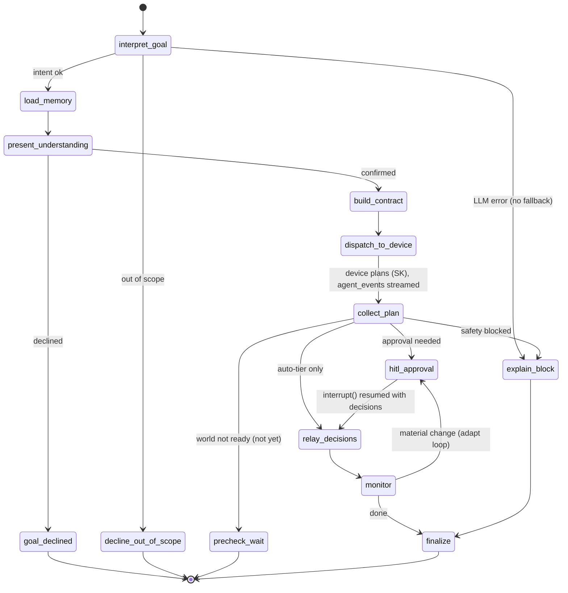

# Cloud Agent Architecture (v3)

## Role

GoalFlow v3 is a **general goal-based agent** (not a meal app). The cloud is one of
three tiers:

| Tier   | Owns                                                    | Never does                    |
|--------|---------------------------------------------------------|-------------------------------|
| UI     | Conversation surface + the Agent Board, approval clicks, the live stream | Talks to the device directly  |
| Cloud  | **Conversation + memory + the board fold**, goal interpretation, the generic Task Contract, HITL, routing | Touches actuators / local state |
| Device | **Local truth**, SK function-calling planner, capability modules, Safety filter, actuators | Talks to the UI directly |

The cloud:

1. Owns the **conversation** with the human and the **family memory** (hard/soft split).
2. **Interprets** the fuzzy goal into a generic **Task Contract** (`dispatch`,
   see [`../CONTRACT.md`](../CONTRACT.md)) — LLM structured output, any domain.
3. **Dispatches** to the device, which does the actual SK function-calling planning
   over its advertised capability modules.
4. **Relays** the streamed `agent_event`s, the plan, `proposal`/`status` to the UI,
   and `approval`/`control` back to the device.
5. Holds the **HITL approval pause** as a durable LangGraph `interrupt()`.
6. **Folds** every goal's frames into the **Agent Board** — one derived
   `GoalSummary` per goal, broadcast as `board_snapshot` / `board_update`
   (deterministic, no LLM; see *The board fold* below).

Two gates, deliberately distinct — **"LLM plans, code checks"**:

- **Safety gate** — deterministic **code on the device**; enforces only
  `constraints.hard`; *blocks*.
- **Approval gate** — the **user via the cloud** (LangGraph `interrupt()`); *waits*.

**LLM-only**: goal interpretation is a real LLM call (OpenRouter, OpenAI-compatible
API). There are **no scripted/rule fallbacks** — if the LLM is unavailable the goal
fails loudly with a structured error, it is never faked.

## The LangGraph StateGraph

`src/goalflow_cloud/graph/nodes.py`. Advanced LangGraph: `StateGraph` +
conditional edges + `interrupt()` HITL + a checkpointer for durable state across
the approval pause. One graph run per goal; `thread_id = goal_id` so the
checkpointer can resume the exact paused state when the approval (or an adaptation
decision) arrives, even across process restarts (swap `MemorySaver` for a
persistent checkpointer without touching the graph).

### State schema

```python
class GraphState(TypedDict, total=False):
    goal_text: str                     # raw user_goal text
    intent: dict                       # normalized intent (LLM structured output):
                                       #   domain, objective, success_criteria,
                                       #   scope, time_window (relative to today)
    memory: dict                       # loaded profile: hard block + soft prefs + context
    understanding: dict                # pre-planning understanding shown to the user
    understanding_confirmed: bool      # user's response to the understanding gate
    contract: dict                     # the assembled generic Dispatch frame
    plan: dict                         # plan_ready payload from the device
    pending_approvals: list[dict]      # proposals awaiting user decisions
    decisions: list[dict]              # approval decisions returned by interrupt()
    task_status: str                   # CONTRACT v3 lifecycle value
    event_log: list[dict]              # append-only agent_event/trace log (Annotated add)
    goal_id: str
    correlation_id: str
    error: str                         # structured failure (LLM-only: no fallback path)
```

### Nodes

| Node               | Harness module          | Does |
|--------------------|-------------------------|------|
| `interpret_goal`   | Goal Interpreter        | LLM **structured output**: fuzzy text → `{domain, objective, success_criteria, scope, time_window}`. Time window derived **relative to real today**. |
| `load_memory`      | Memory & Constraints    | Load the generic profile; split channels: `hard` → verbatim into `constraints.hard`; `soft` + context → planning bias only. |
| `present_understanding` | Understanding Gate (HITL) | **`interrupt()`** with a short LLM-authored `thought` one-liner plus the `knew` hard-constraint chips; pauses until the user confirms or declines via `understanding_response`. |
| `goal_declined`    | (graceful terminal)     | User declined the understanding; ends the run (`task_status="done"`) without ever dispatching to the device. |
| `decline_out_of_scope` | (graceful terminal) | Reached straight from `interpret_goal` when the goal is judged outside what the agent can act on; ends the run with an out-of-scope explanation, no memory load, no dispatch. |
| `build_contract`   | Goal Interpreter + Memory | Assemble + validate the generic `Dispatch`; hard block copied as **data, never LLM output**. |
| `dispatch_to_device` | (hub hand-off)        | Hand the frame to the WS hub; device now grounds/plans (SK function calling) while the cloud relays its `agent_event` stream. |
| `collect_plan`     | (hub hand-off)          | Resume point: the hub feeds the device's `plan_ready` payload into the paused graph. |
| `hitl_approval`    | Approval / Consent (HITL) | **`interrupt()`** with the tiered proposals; graph state checkpointed; resumes with the user's decisions. |
| `relay_decisions`  | Actuator hand-off       | Forward the `approval` to the device; move to executing/monitoring. |
| `monitor`          | Monitor & Adapt         | Track `status`/`proposal`; a **material** change routes back into the approval loop (adapt). |
| `precheck_wait`    | Pre-check Engine (hold) | The device's Pre-check reported the world isn't ready (`precheck.ok is False`) — a "not yet", not a "never": the run holds (→ `END`) so it can resume when the world recovers, instead of falsely completing. |
| `explain_block`    | Trace / Explain         | Safety filter blocked the plan (or an LLM error) → produce the user-facing explanation instead of a plan. |
| `finalize`         | Trace / Explain         | Close out the goal; emit the final trace. |

### Conditional edges

- after `interpret_goal` (`route_after_interpret`): `error` set → `explain_block`
  (LLM-only, fail loudly); out-of-scope → `decline_out_of_scope`; else → `load_memory`.
- after `present_understanding` (`route_after_understanding`): confirmed →
  `build_contract`; declined → `goal_declined` (graceful terminal, no dispatch).
- after `collect_plan` (`route_on_safety`): `safety.gate == "blocked"` →
  `explain_block`; `precheck.ok is False` → `precheck_wait` (the "not yet" hold);
  any proposal with `requires_approval` → `hitl_approval`;
  auto-tier only → `relay_decisions`.
- after `monitor` (`route_on_monitor`): material change / adaptation `proposal` →
  `hitl_approval` (the **adapt loop**); `task_status == "done"` → `finalize`;
  else keep monitoring.

### Diagram



### Checkpointer

`compile(checkpointer=MemorySaver())` (from `langgraph-checkpoint`). Every
`invoke`/`resume` uses `config={"configurable": {"thread_id": goal_id}}`. Each
`interrupt()` — `present_understanding`, `collect_plan`, `hitl_approval`, `monitor`
— persists the paused state, so the approval can
arrive minutes later (or after a reconnect) and resume exactly where it stopped.
The same mechanism carries the adapt loop: an adaptation `proposal` re-enters
`hitl_approval` on the same thread.

`device_id` scopes message *delivery* (multi-session hub routing); `goal_id` scopes
each *graph run* (`thread_id`) and is already isolated per goal, independent of the
hub's session model.

**Known risk:** `MemorySaver` plus the `asyncio.to_thread` fan-out in `server.py`
isn't proven thread-safe under truly-parallel graph writes across concurrent
sessions. If races surface, wrap the graph invoke/resume/`update_state` calls in one
`asyncio.Lock` — cloud graph steps are fast; the LLM work happens on the device.

## agent_event stream relay

`agent_event` frames are a **device → cloud → ui passthrough**: the hub validates
the envelope, tags the log with the `correlation_id`, appends to the graph's
`event_log`, and forwards the frame unchanged. The graph never blocks the stream —
streaming happens at the hub layer while the graph waits at its hand-off points.
`seq` gives the UI ordering + dedupe.

## The board fold (`BoardService`, `board.py`)

`src/goalflow_cloud/board.py`. A **third thing the cloud does**, alongside the
conversation/graph and the family memory. Every other frame is about *one* goal; the
Agent Board is the *session-level* view of *all* goals. The hub already routes every
frame a goal produces, and it is the only place that sees ALL goals of a session — so
`BoardService` folds a goal's frames (`understanding`, `dispatch`, `plan_ready`,
`task_update`, `status`, `proposal`) into **one `GoalSummary` per goal** and the hub
broadcasts it as `board_snapshot` (all goals) / `board_update` (one goal). Regression
gate: `scripts/verify_board.py` (**gate 13**).

**Deterministic, side-effect free — no LLM, no I/O.** That is what makes it testable
and what keeps the board honest: every field on a card traces to something the device
actually *said*, never inferred. (v2 had ten task-status strings and no task model, so
a board built then could only have guessed progress from plan-day vs the clock — a
number that looks authoritative and is fiction.)

`GoalSummary` (`models/contract.py`) is DERIVED by the cloud — the device never sends
one. Its fields: `goal_id`, `client_ref`, `title`, `subtitle`, `domain`, `state`
(`on_track` | `at_risk` | `waiting` | `completed` — the board's four chips),
`task_status`, `progress_pct`, `next_step`, `eta`, `pending_tasks`, `alerts`
(`GoalAlerts{count, severity}`), `activity`, `updated_at`. The card is **born at
`on_understanding`** (a goal blocked behind a human is exactly what a board should
surface), not at dispatch.

Three derivation rules — cloud-internal, **not** wire-contract semantics:

- **`alerts.count` is what is OUTSTANDING, not a running tally.** An alert clears when
  its cause is resolved, not merely when something ran. An adaptation's alert clears
  when the goal *leaves* `"adapting"` — the test is `task_status != "adapting"`, **not**
  whether something executed, because a **decline** executes nothing yet still answers
  the alert (v3.6.1/6.2). A `done` goal carries no open alerts; `danger` never
  downgrades to `warn`.
- **`activity` lists only things that OCCURRED.** Completed task titles and status
  notes are pushed (the last two, rendered "a • b"); a **pending `proposal` is NOT
  activity** — it is what the agent *wants* to do and is waiting on a person, so it
  lives in `next_step` alone (recording it as activity showed the same sentence twice,
  once as ✓ done and once as ➡ next).
- **Day-based progress (v3.2).** Once a goal is running, `progress_pct` is where the
  sim date sits in the goal's window, so one Advance-day moves every card (it falls
  back to the task-DAG progress during planning). The window spans the **GOAL's own
  deadline — `max(` the plan's day-span `,` the goal's `eta` `)`** — so that since v3.5
  real-dated plan days can't let a one-evening checklist (span 1) be driven to 100% by
  a single Advance-day while the deadline is still days out.

A device going offline marks every unfinished card at-risk (`on_device_offline`).
Drill-in (`goal_state_get`) and the proactive **suggestions** list (M8) are served from
the same per-session state.

## Memory: the hard-vs-soft split

`src/goalflow_cloud/memory/store.py` + `data/memory/family_profile.json` (generic,
not meal-only):

- **hard** — the safety policy: `allergens`, `medical`, `dietary`, `budget_cap`,
  `quiet_hours`. Injected **VERBATIM** into `dispatch.constraints.hard` — a pure
  data path the LLM never generates, edits, or paraphrases. The device Safety
  filter enforces exactly this block and nothing else.
- **soft** — free-form preferences (likes/dislikes/habits per domain). Fed to the
  LLM as planning **bias** only; never safety-enforced.
- **family context** — members, routines, notes; grounds the `context` object.

**Known limitation:** unlike the hub's per-`device_id` session routing, memory is
still GLOBAL — `memory/store.py` / `family_profile.json` is shared across every
session, not scoped per home.

## WebSocket hub

`src/goalflow_cloud/server.py` — FastAPI, single `/ws` endpoint.

- **Registration:** first frame must be `hello` (`role: ui|device`); hub replies
  `hello_ack` with a `session_id`. **Multi-session:** a `Session` (one device + N uis)
  is keyed by `device_id`, so multiple homes are connected at once without cross-talk.
  A device reconnect 1012-evicts only the PRIOR socket of the SAME `device_id` (other
  sessions untouched); ui sockets are never evicted. A ui binds via `hello.device_id`,
  auto-binds when exactly one device is online, or is held UNBOUND — it gets a
  `devices` list and binds later via `select_device` (ACKed with `hello_ack.device_id`);
  frames from an unbound ui are dropped. A device hello with no `device_id` defaults to
  `"default"` (zero-config single-pair back-compat). `capabilities` are cached per
  session and replayed to a ui when it binds.
- **Routing (type + sender role, within the sender's session):** `route_message`
  derives `device_id` from the sender socket's session; every relay stays inside that
  session.

  | Incoming `type` | From   | Cloud action |
  |-----------------|--------|--------------|
  | `capabilities`  | device | Cache the module registry; relay to UI. |
  | `user_goal`     | ui     | Run the graph to the `present_understanding` gate → `understanding` to UI; fold the goal onto the board. |
  | `understanding_response` | ui | Resume `present_understanding`; confirmed → `dispatch` to device + fold, declined → `goal_declined` + board re-snapshot (card drops). |
  | `agent_event`   | device | **Passthrough relay** to UI; append to event log; `task_update` folds onto the board. |
  | `plan_ready`    | device | Resume graph; re-wrap as `present_plan` (+`payload.knew`) → UI; fold onto the board. |
  | `proposal`      | device | Relay to UI; feeds the adapt loop; folds onto the board (an outstanding alert). |
  | `status`        | device | Relay to UI; feeds `monitor`; folds onto the board (day-based progress, alert clears). |
  | `approval`      | ui     | Resume the `interrupt()`; forward to device. |
  | `control`       | ui     | Forward to device (generic clock: `advance_day`/`reset`/`set_date`; plus `trigger_event` for the event-driven demo — pure passthrough). |
  | `board_get`     | ui     | Send this session's `board_snapshot` (every folded goal) — first paint or `board_seq` heal. |
  | `goal_state_get`| ui     | Reply from the board's cache: the goal's last plan / status / pending understanding (drill-in). |
  | `suggestion_action` | ui | Accept or dismiss one proactive suggestion; accept starts a real goal; re-broadcast `suggestions`. |
  | `suggestions`   | device | Replace the session's proactive-suggestion list; re-broadcast `suggestions` to the boards. |
  | `day_advanced`  | device | Relay the global world-tick summary (v3.2) to the boards (per-goal `status`/`proposal` already moved the cards). |

  Board-tier outputs the hub emits to uis: `board_snapshot` (every goal, on bind /
  `board_get`), `board_update` (one changed goal, after each fold), and `suggestions`.

- UI and device **never** talk directly; dedupe on `correlation_id`.
- `send_to_device` reports whether the frame was delivered; an undelivered dispatch
  (no device connected for that session) surfaces to the uis as a terminal `status`
  ("Device agent '<id>' isn't connected — start it and try again") instead of leaving
  the UI hung on "planning".

## Structured logging (first-class requirement)

Both agents log **leveled, structured, correlation-id-tagged** lines. On the cloud:

- `LOG_LEVEL` from config; one formatter emitting structured key=value/JSON records.
- Every log record carries `correlation_id` (and `goal_id` when known) via a
  `contextvars`-backed logging filter, so one goal's trail is grep-able across
  hub, graph, and LLM calls.
- Every inbound/outbound frame is logged at INFO with `direction`, `role`, `type`,
  `goal_id`, `correlation_id`; payload bodies at DEBUG.
- Node enter/exit and `interrupt()`/resume are logged — this is the Trace/Explain
  harness surface and the debugging story.

## LLM access

LLM-only via **OpenRouter** (OpenAI-compatible): `OPENROUTER_BASE_URL`
(`https://openrouter.ai/api/v1`), `OPENROUTER_MODEL` (default
`openai/gpt-oss-120b`), through `langchain-openai`'s `ChatOpenAI` with structured
output. No mock, no scripted fallback.
