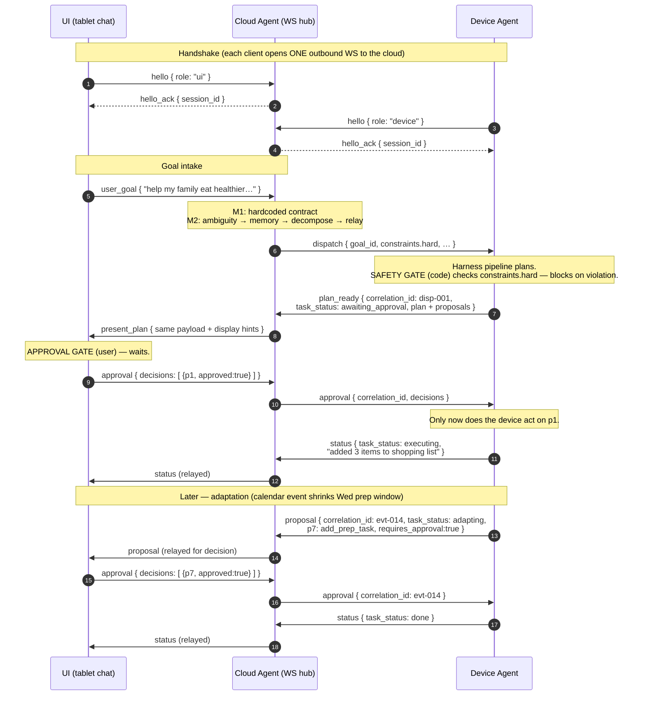
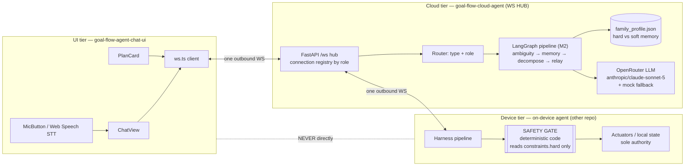

# GoalFlow Diagrams

## 1. Full flow (sequence)

Happy path plus a later calendar-triggered adaptation. Note the two gates:
the **safety gate** runs as deterministic code on the device before anything
is surfaced; the **approval gate** is the user, reached via the cloud.

## 2. Three tiers + WS hub (components)

